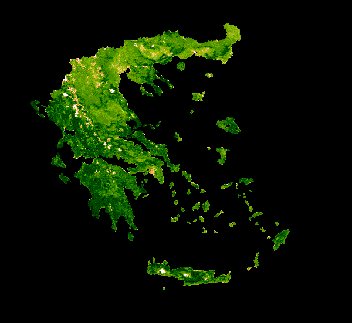

# Visualization and Analysis in GEE
#### MODIS NDVI Time Series for Greece 
Below is a `gif` of the 20 year median NDVI (Normalized Difference Vegetation Index) for Greece. NDVI changes more substantially in the northern mountains of the country, although you can also see less intense changes on the islands in the south. The darkest green (highest vegetation cover) seems to occur in the most norhtern regions of the country. Although the islands also show green (indicating vegetative cover), the color is not as dark, potentially indicating less dense or less productive vegetation. 

This code was based on the [MODIS NDVI Times Series Animation tutorial](https://developers.google.com/earth-engine/tutorials/community/modis-ndvi-time-series-animation#2_define_clipping_and_region_boundary_geometries) from Google Earth Engine, but edited to highlight Greece. 
